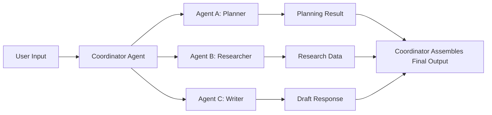

# 🤖 Multi-Agent Pattern

Multiple agents collaborate by handling different responsibilities, optionally delegating tasks and sharing tools or memory.

---

### 🧠 Diagram

> This pattern allows scalability and modularity via distributed agent roles.