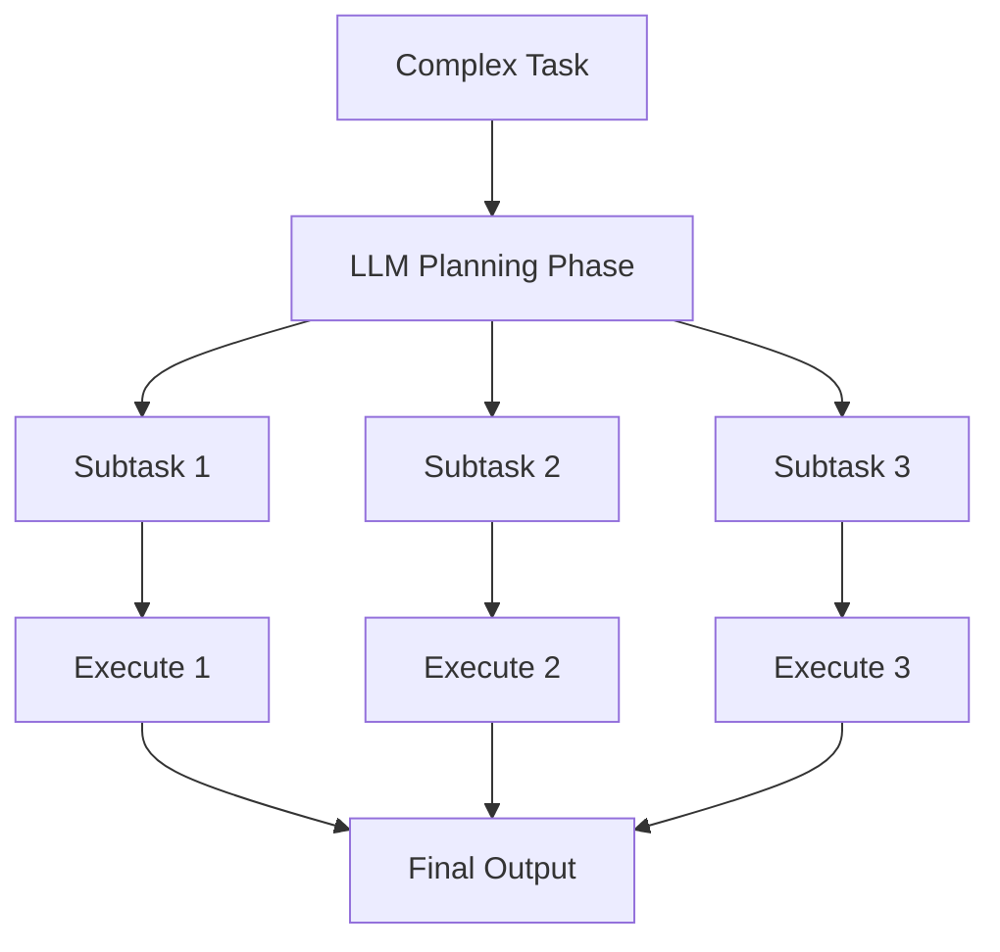

# 🧭 Planning Pattern

The agent **breaks down a complex task** into smaller subtasks, creating an execution plan before taking action.

---

### 🧠 Diagram

> Enables strategic execution and task decomposition.
