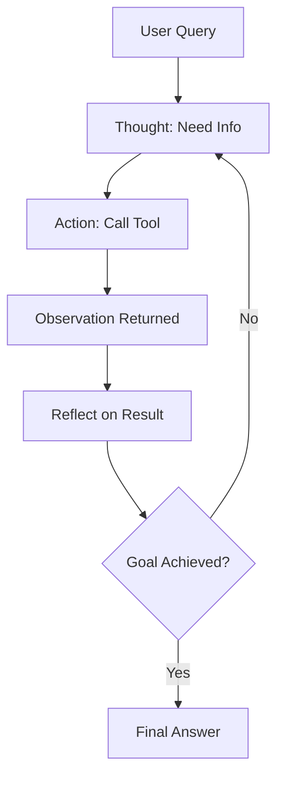

# 🔄 ReAct Pattern (Reasoning + Acting)

Combines **step-by-step reasoning** with **tool use**, allowing the agent to alternate between thinking and doing.

---

### 🧠 Diagram

> This pattern is foundational in frameworks like **CrewAI** and **LangGraph**.

