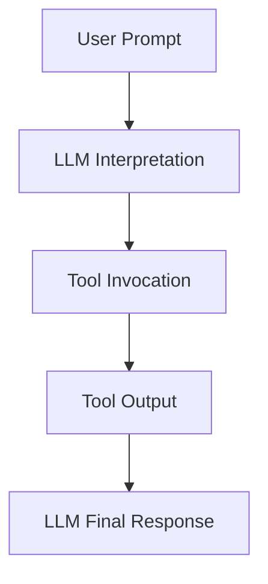

# 🛠️ Tool Use Pattern

The agent leverages **external tools** (e.g., Python, search, vector DBs) to augment its reasoning and improve accuracy.

---

### 🧠 Diagram

> Tools can include:
>
> * Web search
> * Vector DB lookup
> * Python code execution
> * API calls